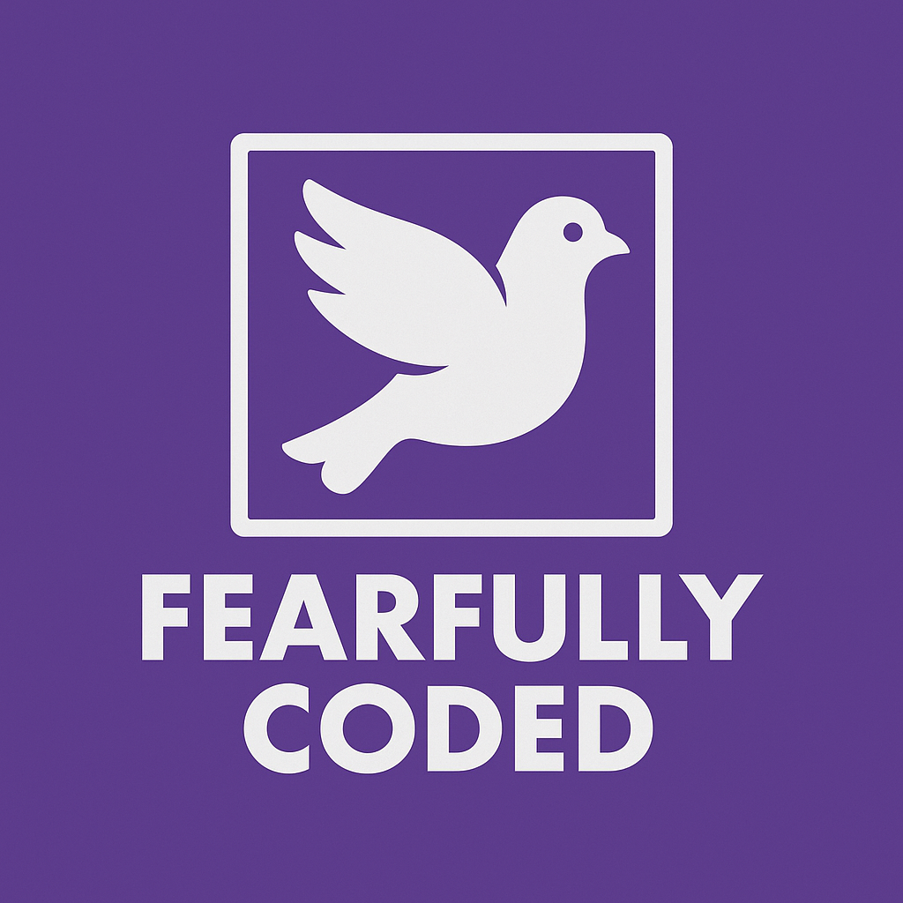

# 🕊️ Fearfully Coded



> *“I praise you, for I am fearfully and wonderfully made.”*  
> — Psalm 139:14

<a href="https://github.com/trevortomesh/fearfully-coded">
  
</a>

**Fearfully Coded** is an open invitation for Christian programmers to dedicate their work to the Lord.

Technology is one of the most powerful — and dangerous — forces shaping our age. From artificial intelligence to pornography, its misuse threatens minds and souls. This project is a small way to respond with prayer, intention, and humility. We believe code can be written in the presence of the Holy Spirit.

---

## ✝️ Mission

To encourage Christian developers to submit their code to God, create in reverence, and remember that all logic, language, and structure ultimately point back to His design.

---

## 🙌 Use the Badge

Add this to your project README to show you're part of the initiative:

```markdown
<a href="https://github.com/trevortomesh/fearfully-coded">
  
</a>
```

---

## 🙏 Prayer for Coders

> Come, Holy Spirit.  
> Guide my mind as I shape logic.  
> Guard my heart as I touch power.  
> Let this code serve not just my plan, but Your Kingdom.  
> In Jesus' name, Amen.

---

## 📜 License

MIT License

---

## ✉️ Want to Contribute?

You can share a prayer, a reflection, or your own faith-aligned software.  
Pull requests welcome.
